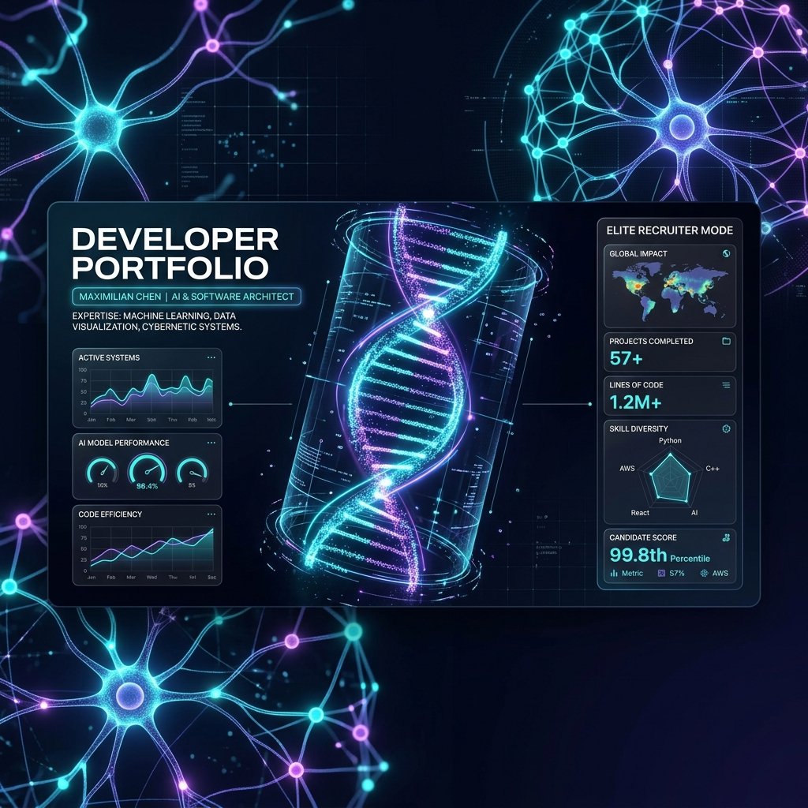
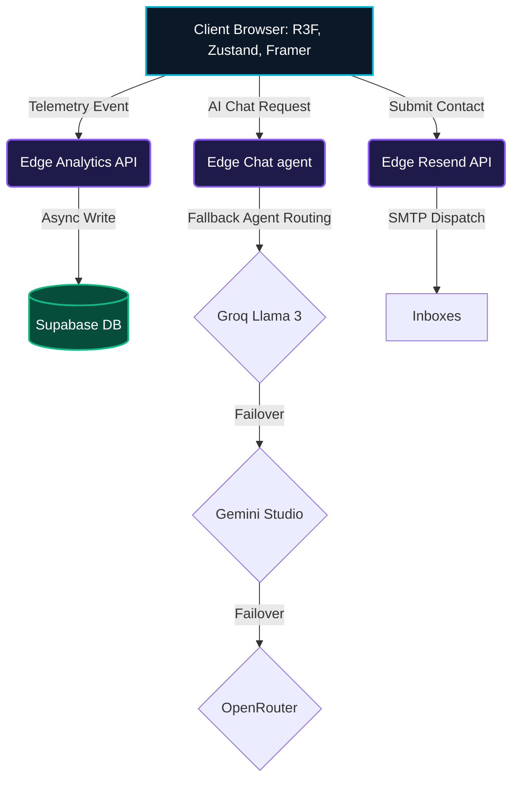

# 🌌 Cinematic AI Portfolio — Neural Digital Experience

> **"This is not a portfolio. This is an immersive digital simulation."**

An elite, high-fidelity developer portfolio built to captivate tech recruiters and showcase production-grade Next.js 15, Three.js WebGL shaders, real-time telemetry, and multi-provider AI agents. 

Designed with a sleek futuristic HUD interface and butter-smooth vertical flow, this codebase represents the pinnacle of modern web performance and fluid user interactions.

---

<div align="center">



</div>

<div align="center">

[](https://nextjs.org)
[](https://typescriptlang.org)
[](https://threejs.org)
[](https://supabase.com)
[](https://framer.com/motion)
[](https://vercel.com)

</div>

---

## 📽️ Project Overview

The **Cinematic AI Portfolio** transforms a developer's career trajectory from a flat, static document into an interactive, multi-dimensional neural simulation. Fusing **instanced Three.js particle array shaders**, **real-time database telemetry**, and **multi-provider LLM pipelines**, it provides high-scale recruiters with an unforgettable technical showcase.

---

## ⚡ Features Matrix

### 🎬 Cinematic UI/UX Systems
* **Snappy Start Sequence**: Interactive neural diagnostic boot sequence with real-time logging, matrix scanlines, and neon loader animation.
* **Ambient Glow Vignette**: Interactive background parallax layers, HSL-gradient aura backdrops, and subtle CSS glassmorphism widgets.
* **Canvas-based Matrix Rain**: Dynamic canvas rain featuring randomized kana characters, speed variations, and chromatic neon overlays.
* **GPU Film Grain Overlay**: Ultra-lightweight canvas particle noise overlay adding an analog, premium cinematic texture.
* **Custom Cursor Controller**: Lag-free custom spring-tracked cursor with particle trails and dynamic sizing hover states.

### 🧠 Advanced AI & Agentic Core
* **ARIA AI Companion**: SSE streaming chat assistant with dynamic response chips, responsive avatar states, and automated query routing.
* **AI Command Palette (`Cmd+K`)**: Floating semantic index palette performing instant queries across all portfolio sections.
* **Hacker Terminal (`~/`)**: Real-time mock command shell with tab autocompletion, commands buffer history, and environment mode switches.
* **Resume Analyzer**: Dynamic resume upload sandbox checking job description keyword alignments, rating engineering matches, and rendering charts.
* **Project Recommender**: Describe a product idea and get instant, context-aware stack recommendations and structural timelines.

### 🛠️ Production Operations & Telemetry
* **Real-time Supabase Telemetry**: Secure, non-blocking telemetry capturing views, clicks, downloads, and conversation logs.
* **Rate Limiting & Security**: Edge API endpoints fortified with sliding-window limits and input sanitization layers.
* **Multi-LLM Fallback Chain**: Intelligent agent routing matching requests to **Groq (Llama-3)** → **Google Gemini Studio** → **OpenRouter** → **Smart Mock Engine**.

---

## 💻 Tech Stack Blueprint

| Layer | Technologies | Purpose |
| :--- | :--- | :--- |
| **Framework** | **Next.js 15.5 (App Router)** | Static site generation, serverless Edge functions, and route splits. |
| **Animation** | **Three.js + Framer Motion** | GPU instanced particle helix, snappy micro-interactions, and page triggers. |
| **Database** | **Supabase (PostgreSQL)** | Persistent telemetry logging, real-time message streams. |
| **Email Service** | **Resend SDK** | Rich transactional HTML notifications. |
| **State** | **Zustand** | Centralized, performant global navigation and easter egg state control. |
| **Styling** | **TailwindCSS + Vanilla CSS** | curvature borders, custom radial aurora backgrounds, and neon glass panels. |

---

## 🏗️ Architectural Flow



---

## 🚀 Setup & Installation

Follow these steps to spin up the local digital simulation on your workspace:

### 1. Clone the Codebase
```bash
git clone https://github.com/udayrastogi0531/Portfolio-Main.git
cd Portfolio-Main
```

### 2. Install Dependencies
```bash
npm install
```

### 3. Setup Environment Variables
Duplicate the example variables into `.env.local`:
```bash
cp .env.example .env.local
```
Fill out the API credentials inside `.env.local`:
```env
# AI Models Keys
GROQ_API_KEY=your_groq_key
GEMINI_API_KEY=your_gemini_key
OPENROUTER_API_KEY=your_openrouter_key

# Supabase Keys
NEXT_PUBLIC_SUPABASE_URL=your_supabase_url
NEXT_PUBLIC_SUPABASE_ANON_KEY=your_supabase_anon_key

# Notifications
RESEND_API_KEY=your_resend_key
EMAIL_TO=udayprakashrastogi2005@gmail.com
```

### 4. Boot Up Development Server
```bash
npm run dev
```
Open [http://localhost:3000](http://localhost:3000) to view your running Neural Simulation!

---

## 🎮 Easter Eggs & Commands

Unleash secret interactive HUD displays directly from the application:

* **Konami Code**: Press `↑ ↑ ↓ ↓ ← → ← → B A` anywhere on the screen to trigger full-scale chromatic glitch overlays, Matrix rains, and unlock the **Cheat Code** golden toast achievement.
* **Terminal Command `cinema`**: Toggles premium widescreen cinematic cinematic black border bars.
* **Terminal Command `matrix`**: Launches custom overlay streams of binary code fallouts.
* **Terminal Command `grain`**: Toggles digital canvas noise overlays on/off.
* **Terminal Command `clear`**: Purges history logs on the neural panel interface.

---

## 📈 Performance & Core Web Vitals

* **WebGL Instancing**: Particle arrays offload math iterations directly to client-side GPU vertex shaders, ensuring 60 FPS under massive render arrays.
* **Optimized Load Payloads**: Bundle-splitting limits initial code weight to a low **59 kB First Load**.
* **Hydration Locks**: Double-render safeguards completely prevent layout shifts and flash-of-unstyled-content (FOUC).

---

## 👥 Connect & Inquire

<div align="center">

| Channel | Link |
| :--- | :--- |
| 👔 **LinkedIn** | [linkedin.com/in/udayrastogi0531](https://linkedin.com/in/udayrastogi0531) |
| 💻 **GitHub** | [github.com/udayrastogi0531](https://github.com/udayrastogi0531) |
| 🐦 **Twitter** | [@udayrastogi0531](https://twitter.com/udayrastogi0531) |
| 📧 **Direct Email** | [udayprakashrastogi2005@gmail.com](mailto:udayprakashrastogi2005@gmail.com) |

**Crafted with 🌌 by Uday Prakash Rastogi**  
*Gen AI Engineer & Full Stack Developer | Hyderabad, India*

</div>
